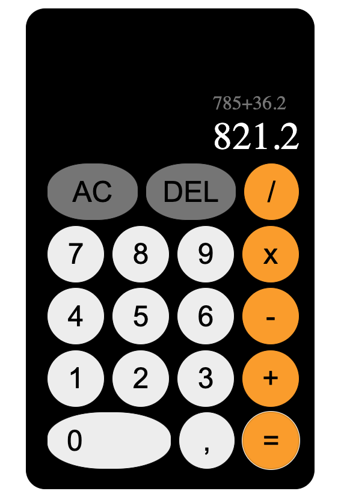

# Basic Calculator

This is a basic calculator built using JavaScript that performs basic arithmetic operations such as addition, subtraction, multiplication, and division. The calculator supports features like decimal point insertion, deleting digits, and resetting the input.

## Features
- **Addition**: Adds two numbers.
- **Subtraction**: Subtracts the second number from the first.
- **Multiplication**: Multiplies two numbers.
- **Division**: Divides the first number by the second.
- **Decimal Point**: Allows the user to insert a decimal point in the numbers.
- **Delete Functionality**: Deletes digits from the current number being input.
- **Reset Functionality**: Resets all inputs and results.
  
## How to Use
1. Click the number buttons to input your numbers.
2. Select an operator (`+`, `-`, `x`, `/`) to choose the arithmetic operation.
3. Click the **=** button to see the result.
4. Use the **AC** button to reset everything.
5. Use the **Delete** button to delete digits or clear the last input.
6. Use the **Comma** button to insert a decimal point.

## Files
- **index.html**: The structure of the calculator.
- **style.css**: Basic styling for the calculator.
- **script.js**: JavaScript to handle the functionality of the calculator.

## Technologies Used
- **HTML**: Structure of the calculator.
- **CSS**: Styling the layout and interface.
- **JavaScript**: Logic for arithmetic operations and user interactions.

## How to Run
1. Clone this repository to your local machine.
2. Open the `index.html` file in a browser to start using the calculator.

## License
This project is licensed under the MIT License - feel free to use, modify, and distribute as needed.

## Author
Theodor Kaljo

Feel free to open issues or contribute to this project!